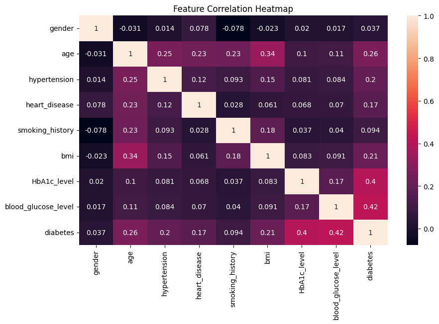

# Diabetes Prediction Project

## Project Overview

This project is a **Machine Learning based Diabetes Prediction System** developed using Python. The main objective of this project is to predict whether a person is diabetic or non-diabetic based on medical and health-related attributes.

The project includes **data preprocessing, exploratory data analysis (EDA), data visualization, and multiple machine learning models** for prediction.

## Technologies Used

* Python
* Pandas
* NumPy
* Matplotlib
* Seaborn
* Scikit-learn
* Google Colab

## Dataset

This project uses the **Diabetes Prediction Dataset** containing health-related features to determine diabetes prediction.

## Features Used

The following features were used in prediction:

* Pregnancies
* Glucose
* Blood Pressure
* Skin Thickness
* Insulin
* BMI (Body Mass Index)
* Diabetes Pedigree Function
* Age

## Project Workflow

1. Importing Required Libraries
2. Loading Dataset
3. Data Preprocessing
4. Exploratory Data Analysis (EDA)
5. Data Visualization using Graphs
6. Splitting Training and Testing Data
7. Model Training using Multiple Algorithms
8. Model Evaluation
9. Diabetes Prediction

## Data Visualization

The project includes various graphical analyses to better understand the dataset, such as:

* Correlation Heatmap
* Feature Distribution Graphs
* Diabetes Outcome Analysis
* Statistical Visualizations
* Data Relationship Graphs

These visualizations help understand feature importance and dataset behavior.

## Machine Learning Models Used

The following machine learning algorithms were used:

* Logistic Regression
* Decision Tree Classifier
* Random Forest Classifier

## Results & Accuracy

The project achieved the following model accuracies:

* **Logistic Regression:** 95.86%
* **Decision Tree:** 95.32%
* **Random Forest:** 97.00%

The **Random Forest model achieved the highest accuracy (97.00%)**, making it the best-performing model for diabetes prediction in this project.

## Files Included

* `Diabetes_Prediction_Project.ipynb` – Complete project notebook
* `diabetes_prediction_dataset.csv.zip` – Dataset used in the project

## Conclusion

This project demonstrates how **Machine Learning can be applied in healthcare** to predict diabetes using medical attributes. Through data analysis, visualization, and predictive modeling, the system helps in understanding patterns related to diabetes and supports early prediction.

## Project Results

### Accuracy Graph
.png)

### Heatmap

### Confusion Matrix

